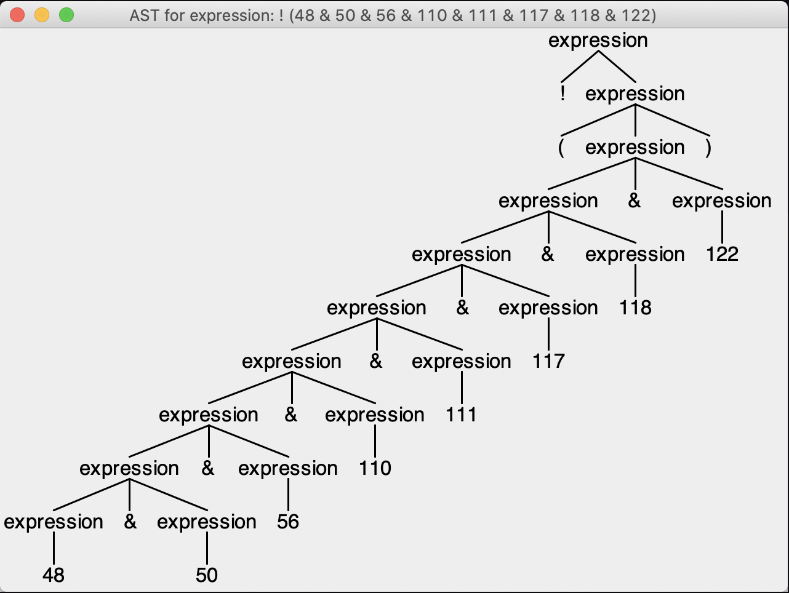

# ANTLR Rule Evaluation Parser
The Rule Evaluation Parser is and auto-generated parser that uses ANTLR. It evaluates whether an array against an expression and returns true or false. 

## About ANTLR
ANTLR is an acronym for **AN**other **T**ool for **L**anguage **R**ecognition which describes a generator of parsers, lexers, and TreeParsers and is developed by Terence Parr.

More documentation can be found here: [https://www.antlr.org/](https://www.antlr.org/)

### Function
The boolean evaluation works as follows:

The method `RuleEvaluation.evaluate()` takes an expression (also called _"rule"_, e.g. `235 & (411 | 425)`, and evaluates it against a set of `String`, e.g. `[48, 50, 56, 110, 111, 117, 118, 122]`. The result of the evaluation can either be `TRUE` or `FALSE`.

### Operators
Known operators for the rule evaluation are:

```
& = and
| = or
! = not
( = curly bracket left
) = curly bracket right
```

### Example set of rules which can be evaluated:
```
! (48 & 50 & 56 & 110 & 111 & 117 & 118 & 122)
(351 & 362)
235 & (411 | 425)
701 & (351 & 362)
A21 | B23 | P43
```

## How to build the project
Use the command `mvn clean package` to build the code from project source directory.

As an alternative, the commands `mvn clean` & `mvn package` can be run sequentially.

## How to run 

### Unit tests
Use the command `mvn test` to run unit tests from project source directory.

### The project
The rule can be evaluated like this `RuleEvaluation.evaluate("! (48 & 50 & 56 & 110 & 111 & 117 & 118 & 122)", [48, 118, 122])`

## Build and run the TreeUI with IntelliJ
The TreeUI can be used to show a graphical representation of the expression. In the example below, the expression `! (48 & 50 & 56 & 110 & 111 & 117 & 118 & 122)` is represented.



The easiest way run the TreeUI is to create a run configuration. You can use the rule `"! (48 & 50 & 56 & 110 & 111 & 117 & 118 & 122)"` as Program Arguments. It will start a Java application and print out the tree view of the expression.
